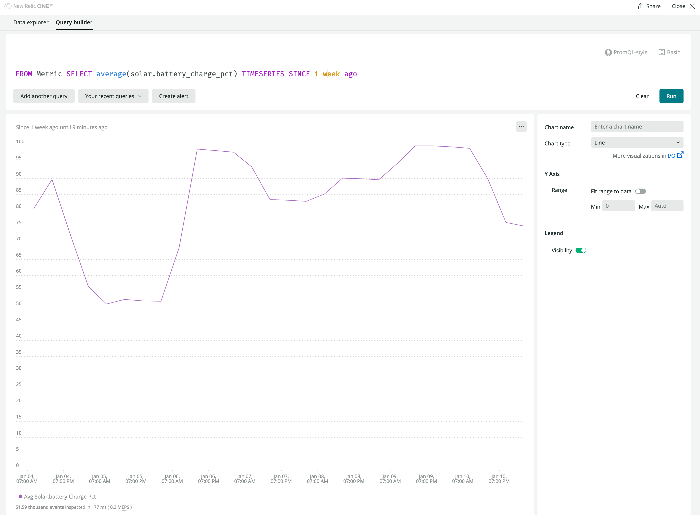
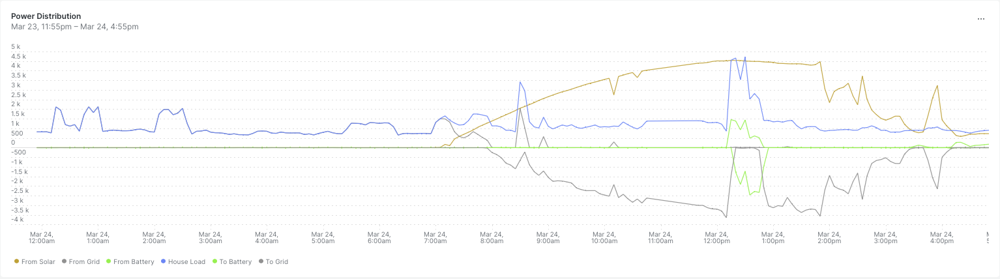
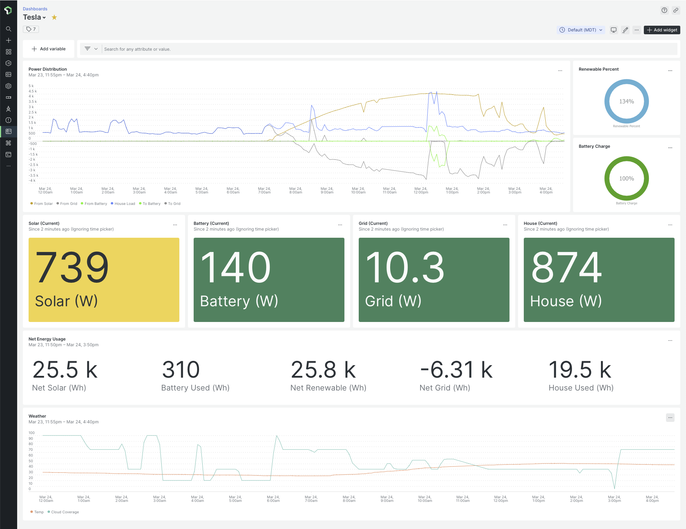

# pwmon

_forked from [eosborne-newrelic/pwmon](https://github.com/eosborne-newrelic/pwmon)_

`pwmon.py` is a quick and dirty python script to demonstrate how to pull information from the Tesla Powerwall API and push it up to New Relic. I use it on my home solar system. If you want to use the weather bits you need to create an account at [openweathermap.org](https://openweathermap.org/).  

## Repo Contents

The only file you need is `pwmon.py`.

The other files to make it easy to run in a container. This is how I do it.

`Dockerfile` is the Dockerfile. Not much to say about this one.

`env.list` is the list of environment variables `pwmon.py` wants to see in order to run.  
If you want to run `pwmon.py` from the CLI, one [good trick](https://stackoverflow.com/q/19331497) is

```shell
export $(grep -v '^#' env.list | xargs)
pwmon.py
```

`requirements.txt` pulls in `tenacity` (a retry library - the Powerwall API has some atrociously low rate-limit), `tesla_powerwall`, and `python-dotenv`.

This code is licensed under Apache 2.0. Essentially - do what you want with it but neither I nor New Relic are to be held liable for it. This is hacked-together demo code and it works for me at home but that's as far as I've taken it.

## Usage

### From the CLI

```shell
user@host pwmon % export $(grep -v '^#' env.list | xargs)
user@host pwmon % ./pwmon.py
submitted at 2022-01-11 08:57:20.332818 return code 0
{'common': {'attributes': {'app.name': 'solar',
                           'mode': 'Self_Consumption',
                           'poll_timestamp': 1641909439380,
                           'status': 'Connected'},
...
```

## Getting data from New Relic

### Querying your data

There's a lot you can do once your data is in New Relic.  Like, a lot.  One sample query to get you started:

`FROM Metric SELECT average(solar.battery_charge_pct) TIMESERIES SINCE 1 week ago`

which looks like this:


Another sample query to build the `Power Distribution` chart, which displays all power flow for today, from the included [dashboard](README.md#creating-a-dashboard):

`FROM Metric SELECT average(solar.from_solar) AS 'From Solar', average(solar.from_grid) AS 'From Grid', average(solar.from_battery) AS 'From Battery', average(solar.to_house) AS 'House Load', average(solar.to_battery) * -1 AS 'To Battery', average(solar.to_grid) * -1 AS 'To Grid' TIMESERIES 5 minutes SINCE today WITH TIMEZONE 'America/Denver'`

which looks like this:


### Using `OPT_GRID_STATUS_GAUGE`

One of the optional gauges you can configure duplicates the Grid Status attribute as a gauge. We use [jrester/tesla_powerwall](https://github.com/jrester/tesla_powerwall)'s `GridStatus` enumeration, converted to integers, since gauges require numeric values. Therefore, you can query the Grid Status using the following mapping:

```python
UNKNOWN = 0
CONNECTED = 1
ISLANDED_READY = 2
ISLANDED = 3
TRANSITION_TO_GRID = 4
TRANSITION_TO_ISLAND = 5
```

### Creating a dashboard

A sample [dashboard](assets/dashboard.json) to get you started is included with `pwmon.py`. To import it, change the `accountId` fields from the dummy value of _9999999_ to your New Relic Account Id, change the [timezone](https://docs.newrelic.com/docs/query-your-data/nrql-new-relic-query-language/get-started/nrql-syntax-clauses-functions/#sel-timezone) clauses (e.g. `WITH TIMEZONE 'xxx/yyy'`), and import it on the [dashboard](https://one.newrelic.com/dashboards) page (see the [docs](https://docs.newrelic.com/docs/query-your-data/explore-query-data/dashboards/introduction-dashboards/#dashboards-import)).

___Important:___ This dashboard requires the [Victory Charts](https://github.com/newrelic/nr1-victory-visualizations) Visualizations. Without them, the `Renewable Percent` and `Battery Charge` circular progress bars will not load.


